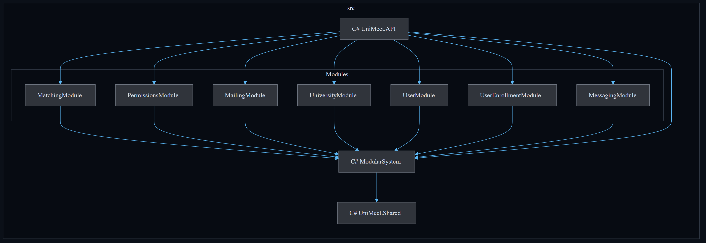
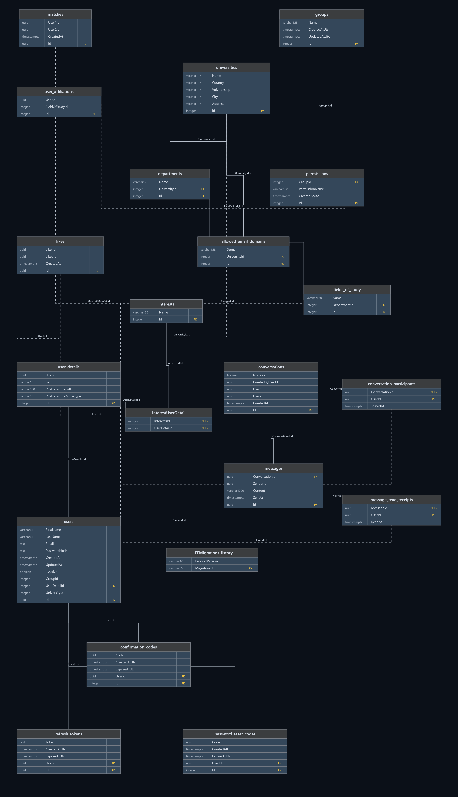

# UniMeet - Backend

> **Project is under active development. Some features may change.**

UniMeet is a platform for university students to connect, meet up and communicate based on shared interests and courses. Students register with their university e-mail address, are enrolled in their university's courses, and can find other students with overlapping enrolments or interests and message them in real time.

---

## Tech Stack

| Layer | Technology |
|---|---|
| Runtime | .NET 9 (ASP.NET Core) |
| Database | PostgreSQL |
| ORM | Entity Framework Core |
| Authentication | JWT Bearer tokens + Refresh Tokens |
| Real-time communication | SignalR |

---

## Architecture

The backend follows a **Modular Monolith** architecture. `UniMeet.API` is the ASP.NET Core host and composition root. It references `ModularSystem` and module root projects, while `ModularSystem` discovers all `IModule` implementations at startup via reflection, reads each module's configuration section, and, if the module is enabled, calls `Start()` followed by `RegisterServices()`.

Modules are isolated from each other. A module must not reference another module directly. Cross-module communication goes through CQRS contracts exposed by `ModularSystem.Contracts`. `UniMeet.Shared` is referenced only by `ModularSystem`; module projects depend on `ModularSystem` instead of depending on `UniMeet.Shared` directly.

```text
src/
|-- ModularSystem/          # Module engine, contracts, mediator-facing abstractions
|-- UniMeet.Shared/         # Cross-cutting primitives used through ModularSystem
|-- UniMeet.API/            # ASP.NET Core host, controllers, SignalR hubs, middlewares
`-- Modules/
    |-- UserModule/
    |-- PermissionsModule/
    |-- UniversityModule/
    |-- UserEnrollmentModule/
    |-- MailingModule/
    |-- MessagingModule/
    `-- MatchingModule/
```

Each module is split into four projects following **Clean Architecture**:

| Layer | Suffix | Responsibility |
|---|---|---|
| Entry point | `<ModuleName>` | `IModule` registration, DI wiring |
| Application | `.Application` | Use-cases / handlers |
| Domain | `.Domain` | Entities, repository interfaces, domain logic |
| Infrastructure | `.Infrastructure` | EF Core contexts, repository implementations |

### Module Dependency Diagram



_Source: [imgs/module-dependencies.mmd](imgs/module-dependencies.mmd)_

No module has a direct dependency on another module. For example, `UserModule` does not reference `UniversityModule`; it requests required university data through CQRS contracts in `ModularSystem.Contracts`. The API arrows show the current composition-root project references to module entry points.

---

## Modules

### User Module

Handles the full user lifecycle: registration, e-mail confirmation, login, token refresh, logout, password reset, user details (bio, avatar, sex) and interests. JWT tokens are issued here; the module also exposes the auth scheme used by the rest of the application.

Key domain concepts: `User`, `UserDetail`, `ConfirmationCode`, `PasswordResetCode`, `RefreshToken`, `Interest`.

### Permissions Module

Role-based access control. Groups are collections of named permissions. Every permission maps to a specific operation exposed by a module, for example `MessagingModule.SendMessage`. Two default groups ship out of the box: **User** and **Admin**.

Key domain concepts: `Group`, `Permission`.

### University Module

Manages university data: universities, departments, fields of study, and allowed e-mail domains used during registration to verify a student's address. Admins can create, update and delete university-related data.

Key domain concepts: `University`, `Department`, `FieldOfStudy`, `AllowedEmailDomain`.

### User Enrollment Module

Tracks which university courses (fields of study) a user is enrolled in. Provides the basis for matching students who share the same courses.

Key domain concepts: `UserAffiliation`.

### Mailing Module

Sends transactional e-mails such as confirmation and password-reset messages via SMTP. This module is stateless and has no database tables.

### Messaging Module

Real-time private and group messaging between users. Conversations and messages are persisted in the database and delivered via SignalR. The module supports conversation participants and per-user read receipts.

Key domain concepts: `Conversation`, `ConversationParticipant`, `Message`, `MessageReadReceipt`.

### Matching Module

Handles likes and matches between users. A match is created when users like each other.

Key domain concepts: `Like`, `Match`.

---

## Database

Every module that requires persistence uses its own **EF Core DbContext** connected to the shared PostgreSQL instance. Migrations are stored inside each module's `Infrastructure` project. Cross-module references are stored as scalar IDs and are marked as logical relationships in the diagram; they are not EF navigation dependencies between module contexts.



_Source: [imgs/database.svg](imgs/database.svg)_

---

## Configuration

All configuration lives in `appsettings.json` and environment-variable overrides when running via Docker. Each module has its own section under `Modules`:

```jsonc
{
  "Urls": "https://localhost:5001",
  "Modules": {
    "UserModule": {
      "Enabled": true,
      "DbConnectionString": "<connection-string>",
      "WebsiteUrl": "http://localhost",
      "Auth": {
        "Secret": "<jwt-secret>",
        "Issuer": "<issuer>",
        "Audience": "<audience>"
      }
    },
    "UniversityModule": {
      "Enabled": true,
      "DbConnectionString": "<connection-string>"
    },
    "UserEnrollmentModule": {
      "Enabled": true,
      "DbConnectionString": "<connection-string>"
    },
    "PermissionsModule": {
      "Enabled": true,
      "DbConnectionString": "<connection-string>",
      "SeedDatabase": false,
      "DefaultGroups": { }
    },
    "MailingModule": {
      "Enabled": true,
      "Smtp": {
        "Host": "<smtp-host>",
        "Port": 587,
        "Username": "<username>",
        "Password": "<password>",
        "SenderName": "UniMeet"
      }
    },
    "MessagingModule": {
      "Enabled": true,
      "DbConnectionString": "<connection-string>"
    },
    "MatchingModule": {
      "Enabled": true,
      "DbConnectionString": "<connection-string>"
    }
  }
}
```

### Running with Docker Compose

Copy `.env.example` to `.env` and fill in the required values:

| Variable | Description |
|---|---|
| `POSTGRES_USER` | PostgreSQL username |
| `POSTGRES_PASSWORD` | PostgreSQL password |
| `POSTGRES_DB` | Database name |
| `POSTGRES_CONNECTION_STRING` | PostgreSQL connection string used by module DbContexts |
| `USER_MODULE_AUTH_SECRET` | JWT signing secret |
| `USER_MODULE_AUTH_ISSUER` | JWT issuer |
| `USER_MODULE_AUTH_AUDIENCE` | JWT audience |
| `USER_MODULE_WEBSITE_URL` | Base URL used in confirmation e-mails |
| `MAILING_MODULE_SMTP_HOST` | SMTP server host |
| `MAILING_MODULE_SMTP_PORT` | SMTP server port |
| `MAILING_MODULE_SMTP_USERNAME` | SMTP username |
| `MAILING_MODULE_SMTP_PASSWORD` | SMTP password |
| `MAILING_MODULE_SMTP_SENDER_NAME` | Display name for outgoing e-mails |
| `PERMISSIONS_MODULE_SEED_DATABASE` | Enables default permissions/groups seeding |

Then:

```bash
docker compose up --build
```

The API is available on ports `8080` (HTTP) and `8081` (HTTPS).

---

## API Endpoints

See: [API Documentation](API_Documentation.pdf)

Swagger UI is also available at `/swagger` when running in Development mode.
